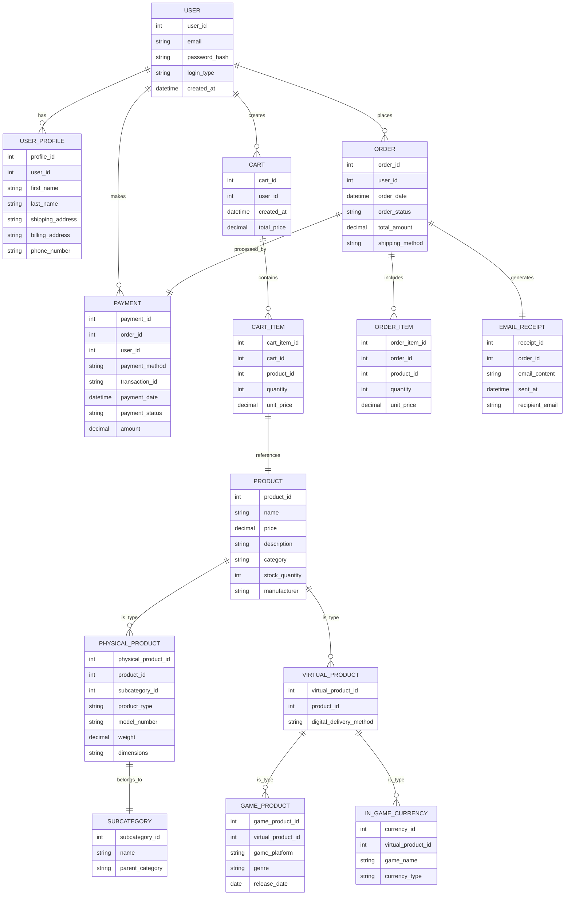

# GameHub 🎮🛒 : Your Ultimate Gaming & Tech Marketplace

## 🖥️ Project Overview
GameHub is an all-in-one e-commerce platform dedicated to providing a comprehensive digital marketplace for gamers, offering an extensive range of products including video games, PC hardware, gaming accessories, phones, and gaming peripherals.

## 🚀 Project Description
GameHub aims to revolutionize the gaming retail experience by creating a centralized platform where gamers can find everything they need. Our mission is to provide a seamless, user-friendly shopping experience for gaming enthusiasts, tech lovers, and casual consumers alike.

GameHub is a comprehensive e-commerce platform designed to serve gamers and tech enthusiasts by providing:
- 🎮 A centralized marketplace for physical videogame copies
- 💻 PC and gaming hardware sales
- 🖱️ Gaming accessories and peripherals
- 🛒 Seamless purchasing experience for tech products
- 💰 All-in-one In-game currency store

### 🎯 Motivation
Para mapasar sa IM2 <3

## 🖼️ Preview


[Click to go to Figma](https://www.figma.com/design/2itXLcuX6kgIyFBwF4ELJX/IM2---GameHub?node-id=168-737&node-type=canvas&t=alwVIH0D3mLeqrZl-0)

## Entity Relational Diagram



## 📋Functional Requirements
- User Registration via Email 
- User Login via Email, Google, and Facebook
- User Profile Management
- Product Search
- Add to Cart
- Payment Method Selection
- Payment Confirmation and Receipt
- Post-Purchase Email Receipt
- View Order History
- Order Cancellation
- Product Details View
- Update Cart Quantity

## 📊 Gantt Chart Contributions
- [Click to download](/GanttChart_Gamehub.xlsx)
- [Click to preview](https://docs.google.com/spreadsheets/d/11PxER5bcgMxnkyM3OBweART3znoyU9kwjY-M0eOI7Ls/edit?gid=0#gid=0)

### ✨ Key Features -- TBC --
- 📂 Comprehensive product catalog spanning video games, PC parts, gaming accessories, and electronics
- 🛍️ Integrated e-commerce functionality
- 🧑‍💻 User-friendly interface
- 🔒 Secure transaction processing
- 📝 Detailed product listings and descriptions


## 🛠 Technologies Used
- **Backend**: 🐍 Python with Django Framework
- **Frontend**: 🌐 HTML, CSS, JavaScript
- **Database**: 🗄️ SQLite
- **Development Environment**: 🖥️ Python-based web development stack

## 📚 Table of Contents
- 🔧 [Installation](#installation)
- 🖥 [Usage](#usage)
- 🤝 [Contributing](#contributing)
- 🔒 [License](#license)
- 👥 [Credits](#credits)
- 📞 [Contact](#contact)

## 🗂️ Project Structure
         IM2---GameHub/
               │
               ├── accounts/        # Main application logic
               ├── images/          # Dashboard Images
               ├── myproject/       # Main Django files
               ├── static/          # Static files (CSS, JS, Images)
               ├── readmefiles/     # Readme Files (ERD, Figma, etc.)
               ├── README.md        # README File
               ├── db.sqlite3       # Main Database File
               └── manage.py        # Django command file

## 🔧 Installation
- TBA or kamo lang bahala lol

### Prerequisites
- Python 3.8+
- Django 3.2+
- pip package manager

### Setup Steps
1. Clone the repository
```bash
git clone https://github.com/yourusername/gamehub.git
cd gamehub
```

2. Create a virtual environment
```bash
python -m venv venv
source venv/bin/activate  # On Windows, use `venv\Scripts\activate`
```

3. Install dependencies
```bash
pip install -r requirements.txt
```

4. Initialize the database
```bash
python manage.py migrate
python manage.py createsuperuser
```

5. Run the development server
```bash
python manage.py runserver
```

## 🖥 Usage

### User Authentication

Default Admin Credentials: 

Username: hanz         
Password: 123

Default Test User Credentials:

Username: test5         
Password: 123

### Steps:
- Open Terminal in VSCode
- Type and run "python manage.py runserver"
- Navigate to `http://localhost:8000` in your web browser
- Create an account or log in
- Browse products across various categories
- Add items to cart
- Complete purchases
- Manage user profile and order history

## 🤝 Contributing - TBC oa ra kaayu
Contributions are welcome! Please follow these steps:
1. Fork the repository
2. Create a new branch (`git checkout -b feature/AmazingFeature`)
3. Commit your changes (`git commit -m 'Add some AmazingFeature'`)
4. Push to the branch (`git push origin feature/AmazingFeature`)
5. Open a Pull Request

## 🔒 License 
<h4> THIS IS A Open-Source Project __ FEEL FREE TO STEAL </h4>
Distributed under the GNU General Public License v3.0. 
See `LICENSE` for more information.

## 🏆 Badges


## 👥 Credits

<h3> Jeastel Mae Maratas </h3> 
<ul>
    <li> 🏗️ Project Manager </li>
    <li> UI/UX Designer </li>
</ul>

<hr>


<h3> Hanz Chester Bacus </h3>
<ul>
    <li> 👨‍💻 God of Coding </li>
    <li> 🔧 Technical Adviser </li>
</ul>

<hr>


<h3> Russell Joshua Palma </h3>
<ul>
    <li> UI/UX Designer </li>
    <li> 🍜 Tig luto ug noodles </li>
</ul>

<hr>

## 🚧 Future Roadmap
- Implement advanced search and filtering
- Add user reviews and ratings
- Develop recommendation engine
- Enhance mobile responsiveness
- Integrate multiple payment gateways

## 🧪 Testing
Run tests using:
```bash
python manage.py test
```

## 📞 Contact

Jeastel Mae Maratas  
- temp@gmail.com

Hanz Chester Bacus   
- temp@gmail.com

Russell Joshua Palma
- temp@gmail.com

Project Link: https://github.com/raaisin/IM2---GameHub/

<hr>


