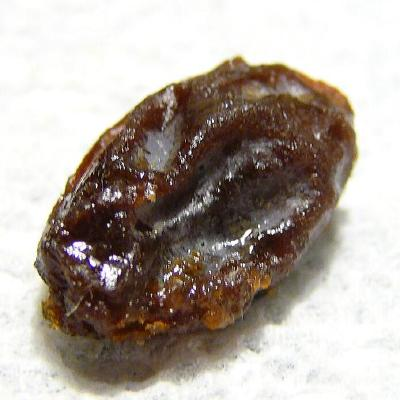

# GameHub 🎮🛒 : Your Ultimate Gaming & Tech Marketplace

## Project Overview
GameHub is an all-in-one e-commerce platform dedicated to providing a comprehensive digital marketplace for gamers, offering an extensive range of products including video games, PC hardware, gaming accessories, phones, and gaming peripherals.

## 🚀 Project Description
GameHub aims to revolutionize the gaming retail experience by creating a centralized platform where gamers can find everything they need. Our mission is to provide a seamless, user-friendly shopping experience for gaming enthusiasts, tech lovers, and casual consumers alike.

GameHub is a comprehensive e-commerce platform designed to serve gamers and tech enthusiasts by providing:
- A centralized marketplace for physical videogame copies
- PC and gaming hardware sales
- Gaming accessories and peripherals
- Seamless purchasing experience for tech products
- All-in-one In-game currency store

### Motivation
Para mapasar sa IM2 <3


### Key Features
- Comprehensive product catalog spanning video games, PC parts, gaming accessories, and electronics
- Integrated e-commerce functionality
- User-friendly interface
- Secure transaction processing
- Detailed product listings and descriptions

### Functional Requirements
- 

## 🛠 Technologies Used
- **Backend**: Python with Django Framework
- **Frontend**: HTML, CSS, JavaScript
- **Database**: SQLite
- **Development Environment**: Python-based web development stack

## 📋 Table of Contents
- [Installation](#installation)
- [Installation](#installation)
- [Usage](#usage)
- [Contributing](#contributing)
- [License](#license)

## Project Structure
         IM2---GameHub/
               │
               ├── accounts/        # Main application logic
               ├── images/          # Dashboard Images
               ├── myproject/       # Main Django files
               ├── static/          # Static files (CSS, JS, Images)
               ├── readmefiles/     # Readme Files (ERD, Figma, etc.)
               ├── README.md        # README File
               ├── db.sqlite3       # Main Database File
               └── manage.py        # Django command file

## 🔧 Installation
- TBA or kamo lang bahala lol

### Prerequisites
- Python 3.8+
- Django 3.2+
- pip package manager

### Setup Steps
1. Clone the repository
```bash
git clone https://github.com/yourusername/gamehub.git
cd gamehub
```

2. Create a virtual environment
```bash
python -m venv venv
source venv/bin/activate  # On Windows, use `venv\Scripts\activate`
```

3. Install dependencies
```bash
pip install -r requirements.txt
```

4. Initialize the database
```bash
python manage.py migrate
python manage.py createsuperuser
```

5. Run the development server
```bash
python manage.py runserver
```

## 🖥 Usage

# User Authentication

Default Admin Credentials: 

Username: hanz         
Password: 123

Default Test User Credentials:

Username: test5         
Password: 123

# Steps:
- Open Terminal in VSCode
- Type and run "python manage.py runserver"
- Navigate to `http://localhost:8000` in your web browser
- Create an account or log in
- Browse products across various categories
- Add items to cart
- Complete purchases
- Manage user profile and order history

## 🤝 Contributing - TBC oa ra kaayu
Contributions are welcome! Please follow these steps:
1. Fork the repository
2. Create a new branch (`git checkout -b feature/AmazingFeature`)
3. Commit your changes (`git commit -m 'Add some AmazingFeature'`)
4. Push to the branch (`git push origin feature/AmazingFeature`)
5. Open a Pull Request

## 🔒 License 
<h4> THIS IS A OSP __ FEEL FREE TO STEAL </h4>
Distributed under the GNU General Public License v3.0. 
See `LICENSE` for more information.

## 🏆 Badges


## 👥 Credits

<h3> Jeastel Mae Maratas </h3> 
<ul>
  <li> Project Manager </li>
</ul>

<hr>


<h3> Hanz Chester Bacuz </h3>
<ul>
  <li> God of Coding </li>
  <li>Technical Adviser</li>
</ul>

<hr>


<h3> Russell Joshua Palma </h3>
<ul>
  <li> Tig luto ug noodles </li>
</ul>

<hr>

## 🚧 Future Roadmap
- Implement advanced search and filtering
- Add user reviews and ratings
- Develop recommendation engine
- Enhance mobile responsiveness
- Integrate multiple payment gateways

## 🧪 Testing
Run tests using:
```bash
python manage.py test
```

## 📞 Contact

Jeastel Mae Maratas  
- temp@gmail.com

Hanz Chester Bacuz   
- temp@gmail.com

Russell Joshua Palma
- temp@gmail.com

Project Link: https://github.com/raaisin/IM2---GameHub/

////////////////////////////////////////////////////////////////////////////////////////////////////////////

# GameHub: Your Ultimate Gaming & Tech Marketplace

## Project Description

### Overview

GameHub is a comprehensive e-commerce platform designed to serve gamers and tech enthusiasts by providing:
- A centralized marketplace for physical videogame copies
- PC and gaming hardware sales
- Gaming accessories and peripherals
- Seamless purchasing experience for tech products
- All-in-one In-game currency store

### Technologies Used
- **Backend:** Python Django
- **Frontend:** HTML, CSS, JavaScript
- **Database:** SQLite
- **Key Technologies:**
  - [LIST_OF_ADDITIONAL_TECHNOLOGIES]

### Motivation
[WHY_YOU_CREATED_THIS_PROJECT]

Challenges we addressed:
- [CHALLENGE_1]
- [CHALLENGE_2]

Future Feature Roadmap:
- [PLANNED_FEATURE_1]
- [PLANNED_FEATURE_2]

## Table of Contents
- [Installation](#installation)
- [Usage](#usage)
- [Features](#features)
- [Contributing](#contributing)
- [License](#license)

## Prerequisites
- Python [VERSION]
- Django [VERSION]
- [OTHER_DEPENDENCIES]

## Installation

### Clone the Repository
```bash
git clone https://github.com/[USERNAME]/[REPOSITORY_NAME].git
cd [REPOSITORY_NAME]

```
### Set Up Virtual Environment
```bash
         python -m venv venv
         source venv/bin/activate  # On Windows use `venv\Scripts\activate`

```
### Run the Development Server

```bash

         python manage.py runserver

```

### Usage
## User Authentication

Default Admin Credentials:

Username: hanz         
Password: 123

Default Test User Credentials:

Username: test5         
Password: 123

## Key Features

[FEATURE_1_DESCRIPTION]
[FEATURE_2_DESCRIPTION]
[FEATURE_3_DESCRIPTION]

## Screenshots

#to add latur

### Project Structure
         gamehub/
         │
         ├── core/           # Main application logic
         ├── users/          # User authentication
         ├── products/       # Product management
         ├── cart/           # Shopping cart functionality
         ├── orders/         # Order processing
         └── static/         # Static files (CSS, JS, Images)

### Team & Contributors


Jeastel Mae Maratas
- Project Manager

Hanz Chester Bacuz
- God of Coding
- Technical Adviser

Russell Joshua Palma
- Tig luto ug noodles

### License
Distributed under the [LICENSE_TYPE] License. See LICENSE for more information.

### Contact

Jeastel Mae Maratas  
- temp@gmail.com

Hanz Chester Bacuz   
- temp@gmail.com

Russell Joshua Palma
- temp@gmail.com

Project Link: https://github.com/raaisin/IM2---GameHub/


# IM2---GameHub
para sa IM2 
Leader:  Jeastel Maratas
Members: Hanz Bacuz
         Russell Joshua Palma

Functional Requirements:


Gantt chart:
https://cebuinstituteoftechnology-my.sharepoint.com/:x:/g/personal/russelljoshua_palma_cit_edu/EW8BgyYGRYFMhLZZBPZv81IBRT8WtT-pP7IZIaXjFNUMWw?e=qDmzeW

ERD:
https://online.visual-paradigm.com/w/doxuyryq/app/diagrams/#diagram:workspace=doxuyryq&proj=0&id=11&type=ERDiagram&width=11&height=8.5&unit=inch

UI/UX (Figma project):
https://www.figma.com/design/2itXLcuX6kgIyFBwF4ELJX/IM2---GameHub?node-id=0-1&t=EAPgZgJwTsI49l2L-1
